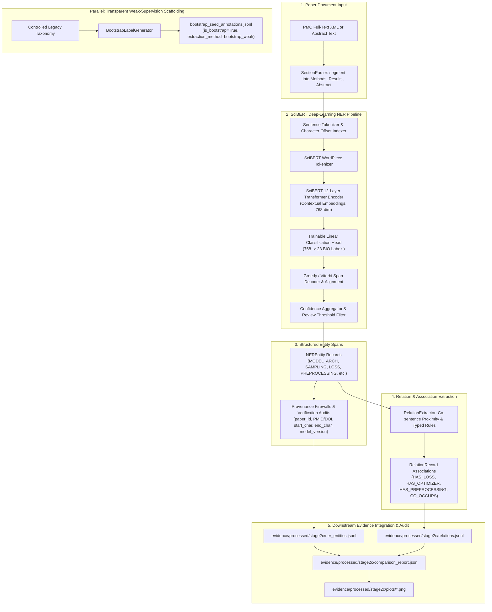

# Stage 2C — Deep-Learning NLP Extraction Architecture

## Overview
Stage 2C replaces heuristic keyword and regex mapping with a genuine scientific deep-learning NLP pipeline based on **SciBERT** (`allenai/scibert_scivocab_uncased`), inspired by the conceptual architecture of Shetty et al.

The pipeline extracts 11 structured research-methodology entity types with contextual embeddings, classifies token spans, associates co-occurring entities via relation extraction, preserves rigorous provenance chains, and enforces safety flags for uncertain extractions.

---

## Architecture Flowchart

---

## Component Details

### 1. 11-Class Methodology Ontology
The entity recognition pipeline is configured for biomedical and ML research methodology:
- `MODEL_ARCH`: Architecture families (e.g. ResNet-18, XGBoost, Transformer, LSTM)
- `PREPROCESSING`: Data preparation (e.g. MICE imputation, one-hot encoding, min-max scaling)
- `SAMPLING`: Class balancing & sampling strategies (e.g. SMOTE, ADASYN, stratified split)
- `FEATURE_REPR`: Feature embeddings & representations (e.g. PCA, t-SNE, embeddings)
- `FUSION`: Multimodal fusion operators (e.g. late fusion, cross-attention, concatenation)
- `LOSS`: Objective functions (e.g. binary cross-entropy, focal loss, dice loss)
- `OPTIMIZATION`: Optimization strategies (e.g. AdamW, SGD, learning rate schedule)
- `REGULARIZATION`: Regularizers (e.g. dropout, L2 weight decay, early stopping)
- `EVALUATION`: Metric specifications (e.g. ROC-AUC, F1-score, Brier score)
- `DATASET`: Public and institutional cohort identifiers (e.g. TCGA, MIMIC, CheXpert)
- `HYPERPARAMETER`: Explicit hyperparameter mentions (e.g. batch size, learning rate)

### 2. Confidence Calibration & Review Gates
- **High Confidence ($\ge 0.80$)**: Automatically accepted.
- **Medium Confidence ($0.60 - 0.79$)**: Accepted, logged for monitoring.
- **Low Confidence ($< 0.60$)**: Flagged with `review_flag = True` and marked `confidence_status = unresolved`.
- **Zero Fallback Policy**: The Transformer NER module **never** silently falls back to regex. If a mechanism cannot be extracted with confidence, it is left unmapped or flagged.

### 3. Provenance Chain
Each entity retains:
- `entity_id`: UUID
- `source_paper_id`, `source_pmid`, `source_doi`
- `start_char`, `end_char`, and exact `source_text` sentence
- `model_version`: `allenai/scibert_scivocab_uncased`
- `extraction_method`: `ExtractionMethod.transformer_ner`
